# Housing Price Prediction

## :pushpin: Abstract
This project is conducted for a real estate company that would like to make a huge investment in the growing areas of Nashville, United States. The goal of this project is to identify if the property is over-valued or under-valued. As such, if the property is under-valued, the real estate company can take the opportunity to buy the property on sale at a low price. Along with this, we would like to determine which elements or variables caused the over-valuation or under-valuation of a property. To achieve this goal, the report focuses on determining which variables are significant in causing the over-valuation and which model to use for finding the results. 

## :mag: Analysis

The data set consisted of a total of 56,636 rows and 31 columns and can be seen in the Appendix Figure 1.1. In this, there were 18 categorical and 13 numerical variables in the data set (Figure 1.2). The data set contained a huge number of missing values (Figure 1.3 and Figure 1.4) and had to be imputed to predict the over-valuation or under-valuation of the housing prices. Some data under “Land Use” column had more than 10 levels, as such they have been reduced to Residential, Commercial and Miscellaneous (Figure 1.5). Since there were many missing values, the irrelevant columns were first removed such as ‘Unnamed: 0.1', 'Unnamed: 0', 'Parcel ID', 'Suite/ Condo   #', 'Property City', 'Property Address', 'Legal Reference', 'Owner Name', 'Address', 'City', 'State', 'Neighborhood', and 'image'. The remaining missing values were imputed by utilizing the K-Nearest Neighbor method with k = 7. After conducting this imputation, there were no missing values which can be observed in the Figure 1.16. To gain a better understanding of the data set, a heat map was created which can be observed in the Appendix Figure 1.14 where it was found that the variable “Sale Price” had a strong positive correlation with “Land Value”, “Building Value”, “Total Value”, “Finished Area” and “Full Bath, the variable “Total Value” had a strong positive correlation with “Land Value”, “Building Value”, “Finished Area”, “Bedrooms” and “Full Bath”, the variable “Land Value” had a strong correlation with “Building Value” and “Full Bath”. 

From analyzing this data set, it was found that the sale prices were higher in the middle of the year and on the last day of the month (Figure 1.9). The year with highest housing sales was in 2015, where more than 160,000 units were sold which was followed by the year 2014. Understanding the sales timelines can give us an idea on the best time to invest in Nashville. In the Figure 1.10, we can see that most of the properties’ foundation type in Nashville were “Crawl”. Thus, it can be inferred that the foundation type “Crawl” is popular in the city. In Figure 1.11, you can observe the number of vacant properties sold in Nashville. As such, most properties sold between 2013 and 2016 were empty or new. Also, this chart shows a good demand for new properties. From the Figure 1.13.1 and 1.13.2, we can interpret that there was a high demand for Nashville properties as compared to the other neighborhood properties where around 40,000 properties were sold in Nashville, the popular foundation type was “Crawl” and the exterior walls was “Brick”. Also, most properties had 3 bed rooms and 2 full bathrooms. 

To build the logistic regression model, the column “Total Price – Sale Price” was the target or dependent variable (Figure 1.17), and the remaining columns were the independent variables i.e., Sale Price, Acreage, Land Value, Building Value, Total Value, Finished Area, Year Built, Bedrooms, Full Bath, Half Bath, Sale Year, Sale Month, Sale Day, Sold As Vacant, Land Use, Tax District, Foundation Type, Exterior Wall, and Grade. The column “Total Price – Sale Price” was created by calculating the difference between the variables “Total Sales” and “Sale Price” to understand the over-valuation or the under-valuation of the property which was given a binary value of 0 or 1. 

### :sparkles: Logistic Regression Model

After this analysis, the logistic regression model was built where the data set was split into 80/20 train and test split and can be observed in the Appendix Figure 2.1. To determine the model performance, the confusion matrix and the classification report was plotted which can be observed in the Appendix Figure 2.2. As such, it can be observed that the true positive value was 7363, true negative value was 3892, false positive was 48 and false negative was 25. Also, the accuracy, precision and recall rate are 0.9935, 0.9878 and 0.9936 respectively and can be observed in the Figure 2.3. This indicated that the model was 99.35% accurate in making predictions, having a precision rate of 0.9878 i.e., the model was 98.78% correct in predicting the positive values and a recall rate of 0.9936 i.e., the model was 99.36% correct in predicting positive classes. 

### :sparkles: Decision Tree Model

After building the Logistic Regression Model, a Decision Tree Model was built with 4 branches to predict the overpricing of the properties in Nashville which can be seen in the Appendix Figure 3.1. To determine the performance, confusion matrix and its classification report was plotted which can be observed in the Appendix Figure 3.2 and Figure 3.3. As such, it can be observed that the true positive value was 7302, true negative value was 3620, false positive was 109 and false negative was 297. Also, the accuracy, precision and recall rate are 0.9641, 0.9707 and 0.9241 respectively and can be observed in the Figure 3.4. This indicated that the model was 96.41% accurate in making predictions, having a precision rate of 0.9707 i.e., the model was 97.07% correct in predicting the positive values and a recall rate of 0.9241 i.e., the model was 92.41% correct in predicting positive classes. 

Comparing the decision tree model to the logistic regression model, it was found that the accuracy, precision and recall rate of the logistic regression model was better than the decision tree model. Also, the false positive and the false negative values in the confusion matrix were much higher in the decision tree model which indicated that the logistic regression model had a better prediction rate. 

### :sparkles: Random Forest Model

From the data provided, a random forest model was built. To determine the performance of the model, the confusion matrix was plotted which can be observed in the Appendix Figure 4.1. As such, it can be observed that the true positive value was 7394, true negative value was 3876, false positive was 17 and false negative was 41. Also, the classification reports and the accuracy, precision and recall rate can be found in the Figure 4.2. In this model, the accuracy, precision and recall rates are 0.9948, 0.9956 and 0.9895 respectively. This indicated that the model was 99.48% accurate in making predictions, having a precision rate of 0.9956 i.e., the model was 99.56% correct in predicting the positive values and a recall rate of 0.9895 i.e., the model was 98.95% correct in predicting positive classes. 

Comparing the random forest model to the other two models, it was found that the accuracy and the precision rate of the random forest model was higher than the other two models whereas the recall rate of the logistic regression model was the highest amongst the other models. However, when the confusion matrix of the two models were compared, it was observed that the false positive value of the random forest confusion matrix was lower than the logistic regression model which indicated that the random forest model’s prediction would be better. 

### :sparkles: Gradient Boost Model

From the data provided, a gradient boost model was built. To determine the performance of this model, the confusion matrix was plotted which can be observed in the Appendix Figure 5.1. As such, it can be observed that the true positive value was 7394, true negative value was 3892, false positive was 17 and false negative was 25. Also, the classification reports and the accuracy, precision and recall rate can be found in the Figure 5.2. In this model, the accuracy, precision and recall rates are 0.9948, 0.9956 and 0.9895 respectively. This indicated that the model was 99.48% accurate in making predictions, having a precision rate of 0.9956 i.e., the model was 99.56% correct in predicting the positive values and a recall rate of 0.9895 i.e., the model was 98.95% correct in predicting positive classes. 

Comparing the random forest model to the other three models, it was found that the accuracy and the precision rate of the gradient boost model and random forest model were higher than the other two models, whereas the recall rate of the logistic regression model was the highest amongst all the other models. However, when the confusion matrix of the three models were compared, it was observed that the false positive value of the gradient boost model and random forest confusion matrix were the same at 17 and were lower than the logistic regression model, whereas the false negative value of the gradient boost model was the lowest compared to all the other models. Thus, it can be inferred that the gradient boost model performed better than the other models. 

### :sparkles: Neural Network Model

From the data provided, a neural network model was built and can be observed in the Appendix Figure 6.1. To determine the performance, the confusion matrix and the classification report were plotted which can be observed in the Appendix Figure 6.2. As such, it can be observed that the true positive value was 7380, true negative value was 3894, false positive was 31 and false negative was 23. Also, the model had an accuracy, precision and recall rates of approximately 99.52%, 99% and 99% respectively which indicated that the model was 99.52% accurate in making predictions, correctly predicted the positive values by 99% and correctly predicted the positive classes by 99%. 
Comparing the neural network model to the other models, it was found that the accuracy rate of the neural network model was the highest than the other models whereas the gradient boost model had the highest precision rate, and the logistic regression model had the highest recall rate. However, when the confusion matrix of all the models were compared, it was found that the false positive value of the gradient boost model and the random forest model were the least and same at 17 whereas the false negative value of the neural network model was the least compared to all the models followed by the gradient boost model. Since the false positive value has more importance in understanding the model prediction, it can be said that the gradient boost model performed better than the other models. 

### :sparkles: Comparison of the Models

To gain a better and clearer understanding of all models built, multiple benchmarking metrics have been used and can be observed below:

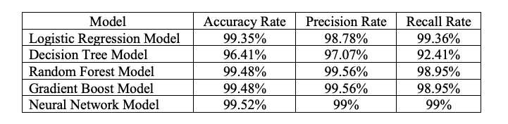

From the above table, it can be observed that the Neural Network Model has the best accuracy rate, whereas the random forest model and gradient boost model have the best precision rate and the logistic regression model has the highest recall rate. However, to understand which model would predict better, the confusion matrix of these models were compared and can be seen below: 

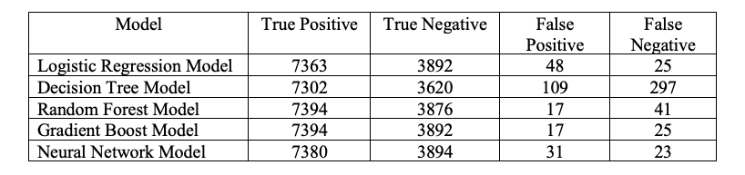

From the above, it can be observed that the Random Forest Model and the Gradient Boost Model had the highest true positive values, the Neural Network Model had the highest true negative value, the Random Forest Model and the Gradient Boost Model had the least false positive values, and the Neural Network Model had the least false negative value followed by the Gradient Boost Model and the Logistic Regression Model. Thus, analyzing the models with the help of the metrics as well as the confusion matrix, it can be said that the Gradient Boost Model would perform better than all the other models. 

## :tada: Conclusion

Based on the above analysis, I found that it was not simple to accurately figure out if the property was over-valued or under-valued. As the accuracy, precision and recall rates of most of the models built were almost similar, I compared the values of their confusion matrix. From this, it could be noticed that the Gradient Boost Model had the highest true positive, second highest true negative, lowest false positive and second lowest false negative. As we are trying to understand if the property is over-valued or not, it’s essential for the model to have the least false positive value as it would be detrimental for the real estate company to have a lot of these values as if the prediction was incorrect, then the company would lose the opportunity of making a profit on buying this property. 

## :memo: References

1. Balodi, T. (2022, July 22). Implementing Gradient Boosting Algorithm Using Python. Retrieved June 23, 2022 from [https://www.analyticssteps.com/blogs/implementing-gradient-boosting-algorithm-using-python](https://www.analyticssteps.com/blogs/implementing-gradient-boosting-algorithm-using-python). 

2. Geeksforgeeks. (2021, November 10). Random Forest Classifier using Scikit-learn. Retrieved June 24, 2022 from [https://www.geeksforgeeks.org/random-forest-classifier-using-scikit-learn/](https://www.geeksforgeeks.org/random-forest-classifier-using-scikit-learn/).

3. Mohadarkar, S. (2021, October 19). Implementing Artificial Neural Network in Python From Scratch. Retrieved June 25, 2022 from [https://www.analyticsvidhya.com/blog/2021/10/implementing-artificial-neural-networkclassification-in-python-from-scratch/](https://www.analyticsvidhya.com/blog/2021/10/implementing-artificial-neural-networkclassification-in-python-from-scratch/).

4. Scikit-learn. (n.d.). sklearn.neural_network.MLPClassifier. Retrieved June 25, 2022 from [https://scikit-learn.org/stable/modules/generated/sklearn.neural_network.MLPClassifier.html](https://scikit-learn.org/stable/modules/generated/sklearn.neural_network.MLPClassifier.html).

## :framed_picture: Appendix

Figure 1.1: Data set

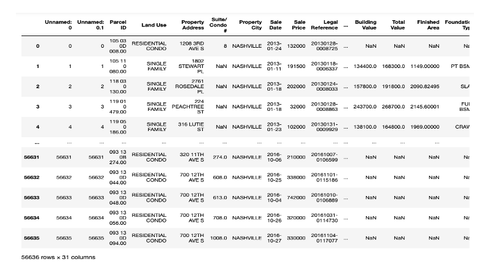

Figure 1.2: Data types of the data set

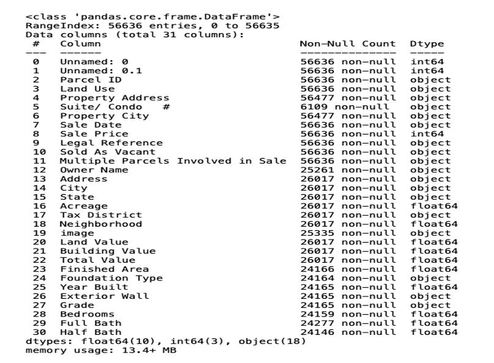

Figure 1.3: Missing values 

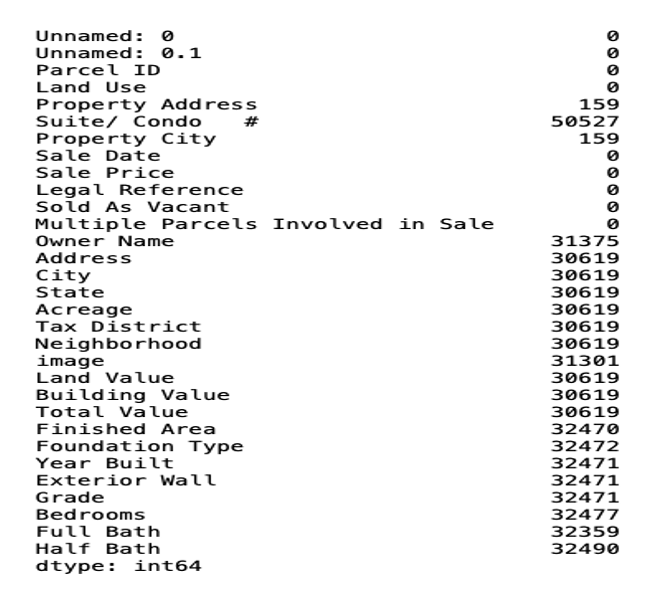

Figure 1.4: Missing values heat map

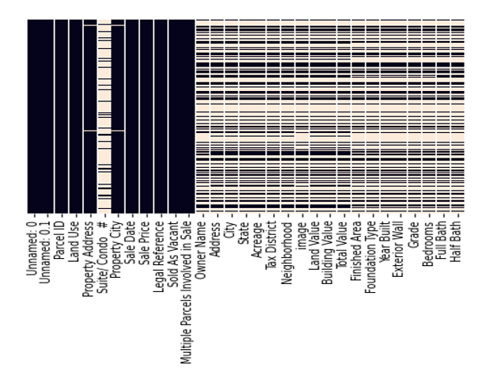

Figure 1.5: Description of the data set

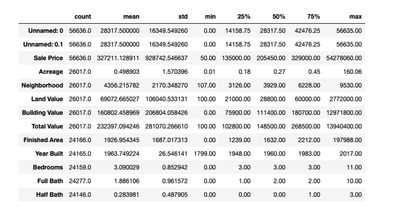

Figure 1.6: Distribution of the variable “Grade”

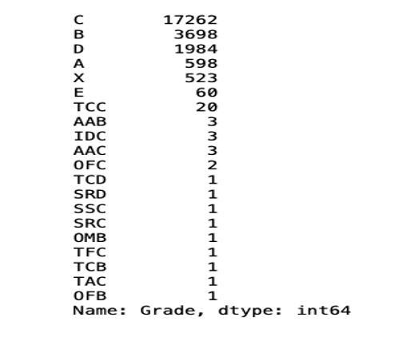

Figure 1.7: Distribution of the variable “City”

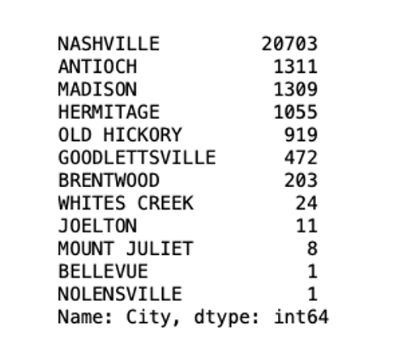

Figure 1.8: Visualization of the variable “City”

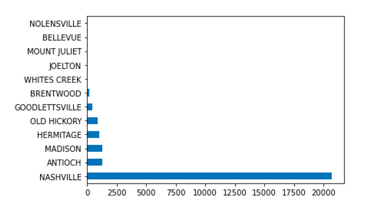

Figure 1.9: Visualization of the Sale Year, Month and Day

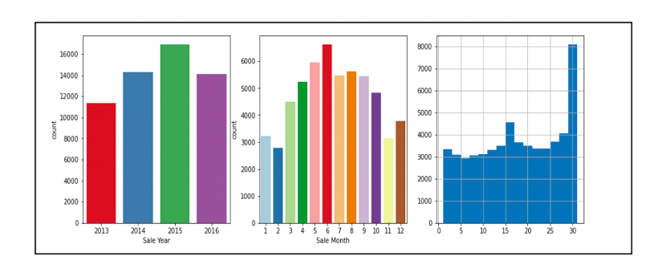

Figure 1.10: Visualization of the variable “Foundation Type”

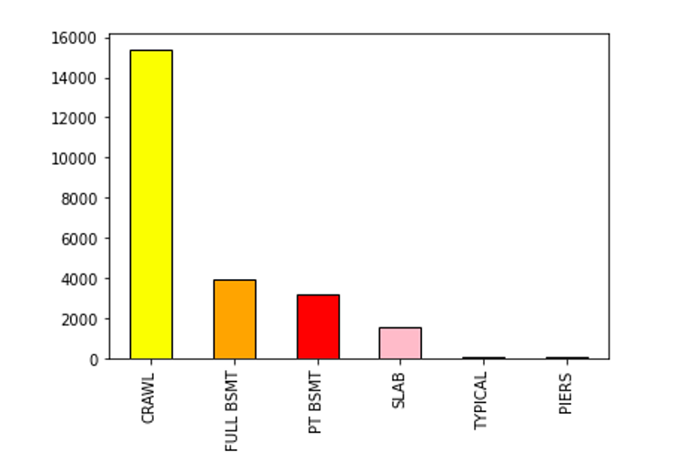

Figure 1.11: Visualization of the variable “Sold As Vacant”

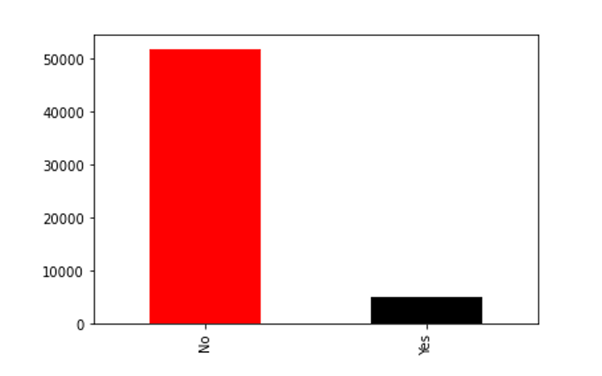

Figure 1.12.1: Visualization of the dataset

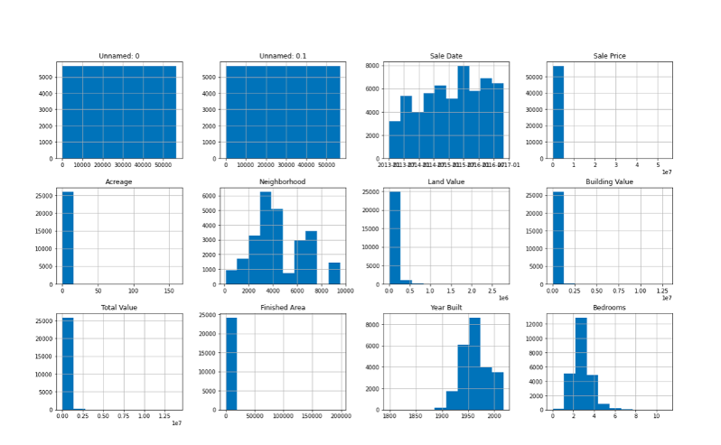

Figure 1.12.2: Visualization of the dataset

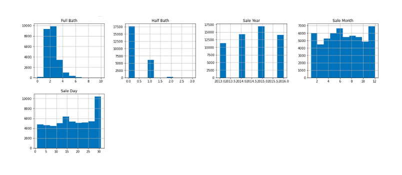

Figure 1.13.1: Visualization of the categorical variables

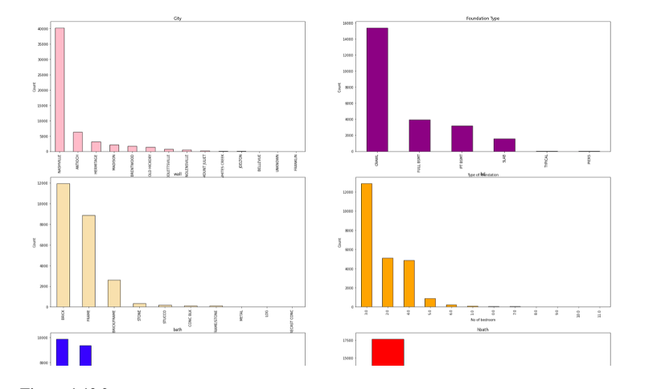

Figure 1.13.2: Visualization of the categorical variables

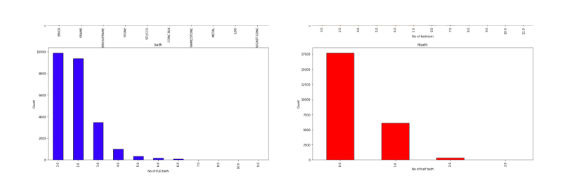

Figure 1.14: Heat Map of the data set

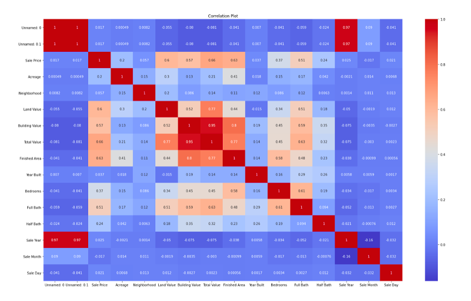

Figure 1.15: Distribution of the variable “Land Use”

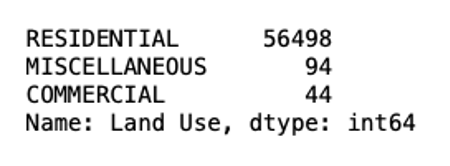

Figure 1.16: Missing values imputed by K-Nearest Neighbor Imputation

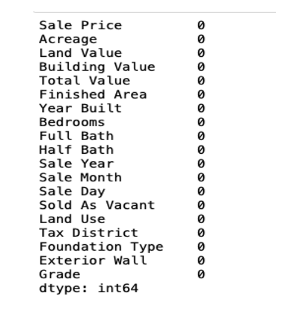

Figure 1.17: Creation of new variable “Sale Price – Total Value”

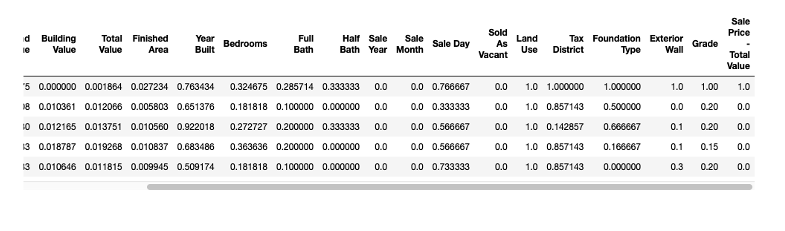

Figure 2.1: Logistic Regression Model

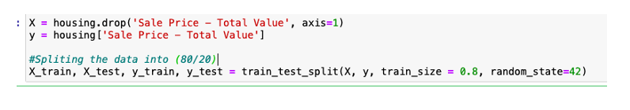

Figure 2.2: Confusion Matrix and the classification report

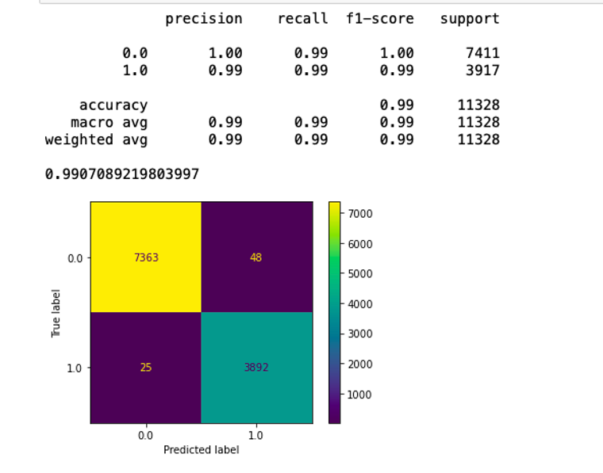

Figure 2.3: Accuracy, Precision and Recall Rate of the Model

Figure 3.1: Decision Tree Model

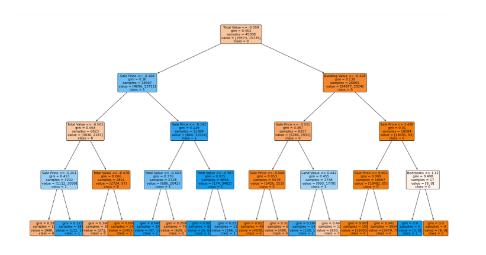

Figure 3.2: Confusion Matrix of the model

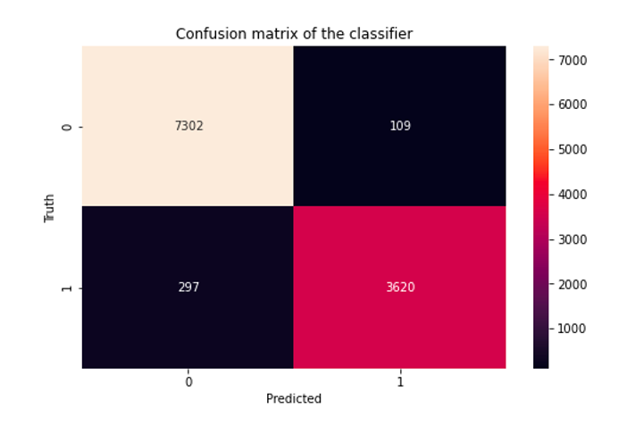

Figure 3.3: Classification Report

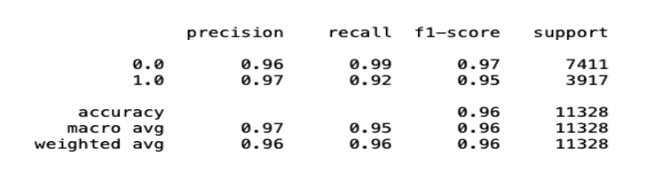

Figure 3.4: Accuracy, Precision and Recall Rate of the model

Figure 4.1: Confusion Matrix of the Random Forest Model

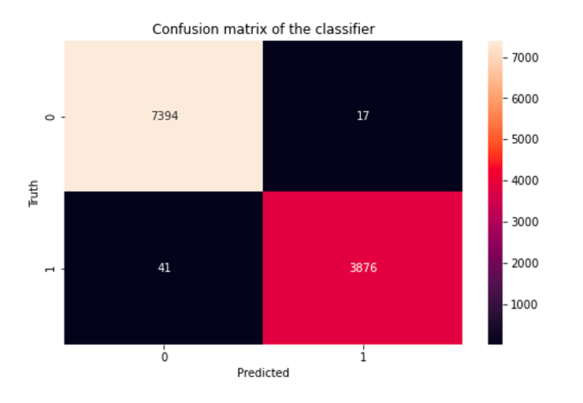

Figure 4.2: Classification Report along with the accuracy, precision and recall rate of the Random Forest Model

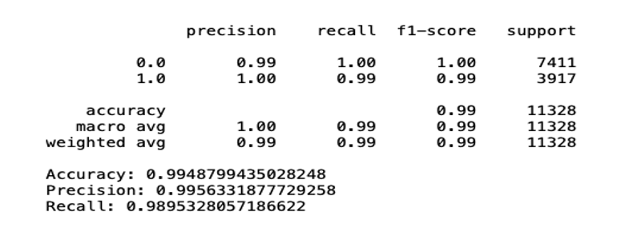

Figure 5.1: Confusion Matrix and the classification report of the Gradient Boost Model

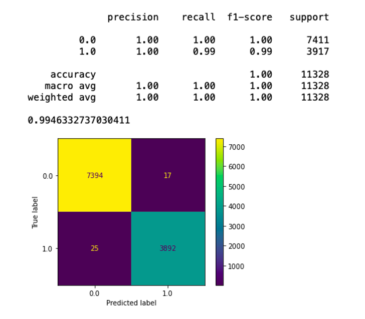

Figure 5.2: Accuracy, Precision and the Recall Rate of the Gradient Boost Model

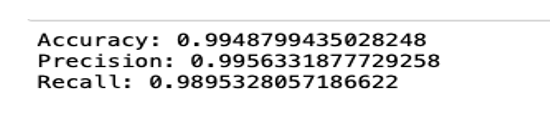

Figure 6.1: Neural Network Model

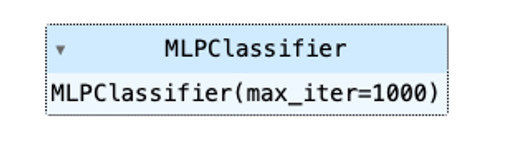

Figure 6.2: Confusion Matrix and the classification report of the Neural Network Model

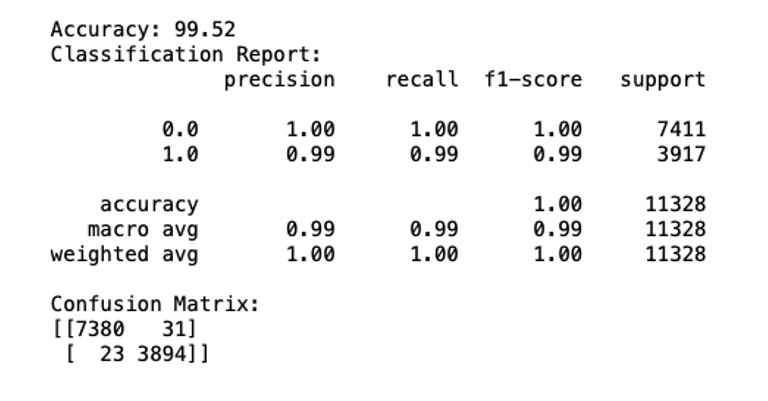